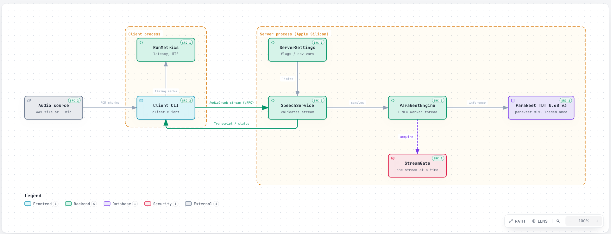

# Spanish Streaming ASR over gRPC

A local ML microservice: a gRPC server owns the `mlx-community/parakeet-tdt-0.6b-v3` model on Apple Silicon and
transcribes Spanish audio streamed by a thin client (a WAV file or the live microphone).



## Quick start

```bash
python3.13 -m venv .venv && source .venv/bin/activate
pip install -r requirements.txt
./scripts/gen_proto.sh                              # generate speech_pb2*.py into generated/
python -m server.server                             # terminal 1 (first run downloads the model)
python -m client.client path/to/spanish.wav         # terminal 2 (16-bit PCM WAV, 16 kHz mono)
python -m client.client --mic                       # or speak into the microphone; Enter stops
pytest                                              # model-free tests
```

On macOS, allow Microphone access for your terminal for `--mic`.

## Configuration

Flags override env vars, which override defaults.

| Env var | Flag | Default |
|---|---|---|
| `MODEL_ID` | `--model-id` | `mlx-community/parakeet-tdt-0.6b-v3` |
| `GRPC_HOST` / `GRPC_PORT` | `--host` / `--port` | `localhost` / `50051` |
| `AUDIO_SAMPLE_RATE` / `AUDIO_CHANNELS` | `--sample-rate` / `--channels` | `16000` / `1` |
| `PARTIAL_EVERY_N_CHUNKS` | `--partial-every-n-chunks` | `1` |
| `MAX_STREAM_SECONDS` | `--max-stream-seconds` | `300` |
| `STREAM_WAIT_SECONDS` | `--stream-wait-seconds` | `30` |
| `LOG_LEVEL` | `--log-level` | `INFO` |
| `CHUNK_SIZE` (client, ms) | `--chunk-ms` | `500` |

## How it works

`proto/speech.proto` defines `SpeechService.Transcribe(stream AudioChunk) returns (stream Transcript)`.
The first `AudioChunk` carries the `AudioConfig` (sample rate, channels, encoding); every later one carries raw
PCM audio. The server keeps one `parakeet-mlx` streaming context per call, sends a partial transcript every N
chunks, and one final transcript when the client closes the stream. The model is loaded once at startup.

Generated code is never edited: run `scripts/gen_proto.sh` to regenerate it.

## Limitations

- Partials come from decoding the audio buffered so far, so earlier words may be revised.
- Streams are processed **one at a time**; a second one waits up to `STREAM_WAIT_SECONDS`, then gets `UNAVAILABLE`.
- Only 16-bit PCM at the configured sample rate and channels is accepted; nothing is resampled.
- Parakeet v3 is multilingual and detects the language itself.
- No authentication or TLS.

## Errors

| Status | When |
|---|---|
| `INVALID_ARGUMENT` | bad or missing config, unsupported format, empty or misaligned audio |
| `FAILED_PRECONDITION` | model not ready |
| `RESOURCE_EXHAUSTED` | stream longer than `MAX_STREAM_SECONDS` |
| `UNAVAILABLE` | server busy or shutting down |
| `INTERNAL` | generic message; the stack trace stays in the server log |

## Latency

The client prints time to first transcript, total time, and **RTF = processing time / audio duration**.
A 10 s Spanish recording gave RTF 0.87 on a cold start and about 0.5 once warm.

## Layout

`proto/` contract · `generated/` generated code · `server/` · `client/` · `tests/` ·
`scripts/` (`gen_proto.sh`, `record_wav.py` to record a test WAV; needs `requirements-record.txt`)
